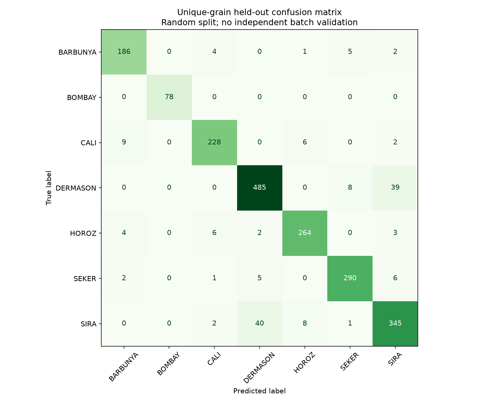
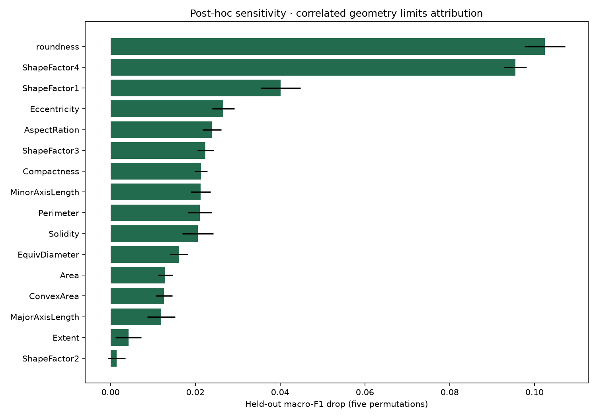

# Seed Variety Classification — Unique-Grain Morphology

Classify seven registered dry-bean varieties from provided image-derived morphology features, with duplicate-aware splits, validation-selected models, calibration and honest batch-generalization limits.



## Source and task

[UCI Dry Bean](https://archive.ics.uci.edu/dataset/602/dry+bean+dataset), Koklu & Ozkan (2020), [DOI](https://doi.org/10.24432/C50S4B), **CC BY 4.0**. Original researchers collected/segmented images and extracted **16 numeric morphology features** from **13,611 grains**, seven registered varieties. This project uses the published ARFF features; it does not implement original image segmentation or claim raw-photo availability. No protein, germination, seed quality or disease label is predicted. [Attribution, units and source spelling](data/README.md), [archive checksum](data/source-manifest.json). Code MIT applies separately.

Exact-feature audit found **68 redundant same-label rows**, removed before splitting; zero conflicting-label rows and zero missing cells. **13,543 unique feature records** remain. Preserve original feature names, including 'AspectRation' and 'roundness'. Source grain-row identifiers track split membership; farm/plant/batch/camera IDs are unavailable.

## Leakage controls and fixed protocol

Seed 42, stratified **70/15/15** unique-grain train/validation/test: **9,480 / 2,031 / 2,032** rows. Exact feature hashes and source IDs are disjoint. Scale only training inputs. Compare majority, fixed standardized logistic C=1, balanced RF (200 trees, depth 12, leaf 2) and standardized RBF SVM (C=10, gamma=scale). Select solely on **validation macro-F1**, which treats all seven classes equally; BOMBAY is much smaller than DERMASON.

Fit one temperature on the selected model's validation scores by minimizing multiclass negative log likelihood. The same validation set supports selection and calibration, so it can be overfit; no independent calibration set is claimed. SVM one-vs-rest scores become auxiliary softmax probabilities, not native SVM probabilities. Temperature **0.42266149** is fixed before inspecting test. No model/threshold reselection follows test analysis.

## Executed results

| Method | Validation macro-F1 | Test macro-F1 | Test accuracy |
|---|---:|---:|---:|
| Majority | 0.0593 | 0.0593 | 0.2618 |
| Logistic | 0.9302 | 0.9347 | 0.9218 |
| Random Forest | 0.9323 | 0.9271 | 0.9134 |
| **RBF SVM (selected)** | **0.9381** | **0.9361** | **0.9232** |

Selected-model test auxiliary probability log loss **0.4931 → 0.3046**, multiclass Brier **0.2345 → 0.1410**, ten-bin ECE **0.2517 → 0.0021**, before/after validation temperature scaling. Small aggregate ECE is not a guarantee of reliable field confidence. SVM voting predicts the label; transformed score argmax differs in **one of 2,032** test rows. The API reports both, and the returned variety_probability corresponds to the voting label. Probability metrics evaluate the auxiliary score distribution; voting accuracy/F1 use the unchanged classifier decision.

Main confusions include **39 DERMASON → SIRA** and **40 SIRA → DERMASON**; BOMBAY's 78 test grains are classified correctly in this split. This does not establish perfect BOMBAY generalization or independence of batches. [Complete metrics and class report](reports/metrics.json), [predictions and probabilities](reports/test-predictions.csv), [split membership](reports/split-membership.csv), [model comparison](reports/comparison.csv).



Five held-out permutations measure macro-F1 sensitivity. Correlated geometry limits individual-feature attribution; negative drops can occur. Importance is analysed after evaluation and does not drive feature or model reselection. No causal shape-variety claim is made.

## Reproduce (Python 3.12)

```bash
python -m venv .venv
# Activate using your platform's command.
python -m pip install -r requirements-lock.txt
python -m pip install --no-deps -e .
python -m seed_classifier.train
python -m seed_classifier.predict
python -m pytest -q
```

The official 4.5 MB archive downloads and verifies its frozen SHA-256. Only fixed ARFF/text members are extracted. Raw source and trusted locally trained joblib are saved locally and excluded from Git. Inference accepts exactly the original 16 finite positive morphology inputs; example-input.json is one real held-out grain. Load only locally produced, trusted artifacts.

[Executed notebook](notebooks/01_evidence.ipynb), [verification](docs/verification.md), [French learning guide](docs/learning-guide.md), [interview notes](docs/interview-notes.md), [design](docs/design.md). CI is pending scheduled publication. Random grain splitting, even after deduplication, cannot establish performance on independent farms, cameras, years or unknown varieties. Acquire batch-labelled external data for deployment claims. Development assisted by AI; understand the supplied explanations before presenting the work.


## GitHub publication

[Public repository](https://github.com/idrisslemnouni-crypto/seed-variety-classification) · [Current CI results](https://github.com/idrisslemnouni-crypto/seed-variety-classification/actions). Published following the user's explicit 5 October 2026 request to release the prepared portfolio together. Earlier local-verification notes describe the pre-publication checkpoint. Raw sources and trained artifacts remain excluded from Git; reproduction commands regenerate them.
